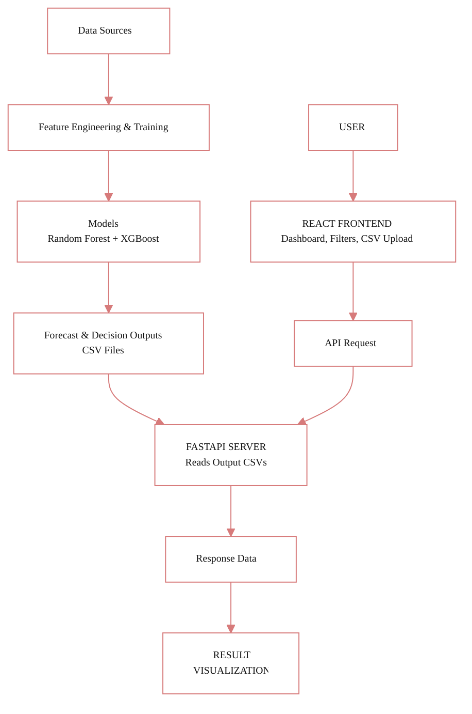

# System Flowchart (Simple)

```mermaid
%%{init: {"theme": "base", "themeVariables": {"primaryColor": "#ffffff", "primaryTextColor": "#111111", "primaryBorderColor": "#d77b7b", "lineColor": "#d77b7b", "fontFamily": "Segoe UI, Arial, sans-serif", "fontSize": "10px"}}}%%
flowchart TB
  A["Data Sources"] --> B["Feature Engineering & Training"]
  B --> C["Models<br/>Random Forest + XGBoost"]
  C --> D["Forecast & Decision Outputs<br/>CSV Files"]
  D --> S["FASTAPI SERVER<br/>Reads Output CSVs"]
  U["USER"] --> R["REACT FRONTEND<br/>Dashboard, Filters, CSV Upload"]
  R --> Q["API Request"]
  Q --> S
  S --> P["Response Data"]
  P --> V["RESULT\nVISUALIZATION"]
```
